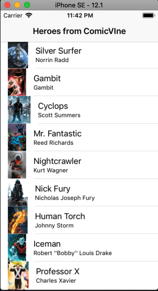

# ComicVineTableViewExample

- [ComicVineTableViewExample](#comicvinetableviewexample)
  * [Objective](#objective)
  * [YouTube Video](#youtube-video)
  * [Implementation](#implementation)
    + [The Source files and StoryBoard](#the-source-files-and-storyboard)
    + [Example of user flow](#example-of-user-flow)
  * [Requirements](#requirements)
  * [How to Contribute](#how-to-contribute)
  * [License](#license)
  * [Restriction of data used in this tutorial](#restriction-of-data-used-in-this-tutorial)
  * [Some Notes](#some-notes)

## Objective

This project is the first in a series of tutorials on IOS development.

In this application I will demonstrate how to build a simple app that uses a TableView  from an json file to list a collection of heroes, and by tapping one of them go to a second detail screen with a downloaded picture, and a button to navigate to the website from which I extracted all this information.

The website is [ComicVine](https://comicvine.gamespot.com/), one of the best and most complete sites about superheroes that I could already find on the Internet.

The application uses only 30 items (heroes) to demonstrate the construction of this prototype and does not use the api provided by the site, as it is a tutorial for beginners and do not approach network concepts, api, authentication, advanced error handling, etc. (yet).

These items will be covered at a later time when possible.

## YouTube Video

The video that explains the creation of this application can be seen in (coming soon) ...

## Implementation

The app will have two view controller scenes.
-**HeroesTableViewController** Basic list of Heroes coming from json file.
-**HeroDetailViewController** Allow user to a little description about the Hero, and open Safari to see the full content on main website at ComicVine.

### The Source files and StoryBoard

### Example of user flow

App opens, loads the local json file into a table view.

User can scroll the table to see more content.

Tapping any item on table, user goes to the detail screen. Tapping superior left back button, returns to table view list.

User taps the `Go to Web Site` button, and navigate to the main website with a full profile description of selected Hero.

User taps on top left button to return to the APP.

## Requirements

- Xcode 10.1 and Swift 4.2

## How to Contribute

Find any typos? Have another resource you think should be included? Contributions are welcome!

First, fork this repository. I'll be happy to know if this example is useful for you.

Next, clone this repository to your desktop to make changes.

Once you've pushed changes to your local repository, you can create a pull request with your suggestion.

It's good take a look at the [Contributing Guide](CONTRIBUTING.MD)

## License

The contents of this repository are covered under the [MIT License](LICENSE.txt).

## Restriction of data used in this tutorial

This tutorial is strictly for non-commercial use. If you want to use the data and images used in this Tutorial, please read the Terms of Use on ComicVine Web Site.

Original source of information and images: [ComicVine](https://comicvine.gamespot.com/)

[API Usage](https://comicvine.gamespot.com/api)

[Legal Terms](https://legalterms.cbsinteractive.com/terms-of-use)

## Some Notes

Thanks to all the contributors and maintainers of this website. I am sure that it is one of the best and most complete references for lovers of comics ever made.

<small><i><a href='http://ecotrust-canada.github.io/markdown-toc/'>Table of contents generated with markdown-toc</a></i></small>